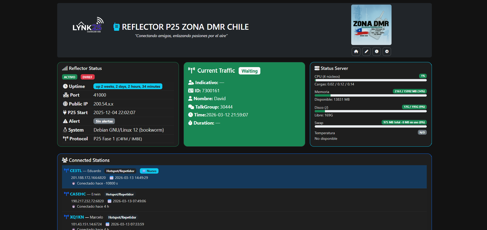
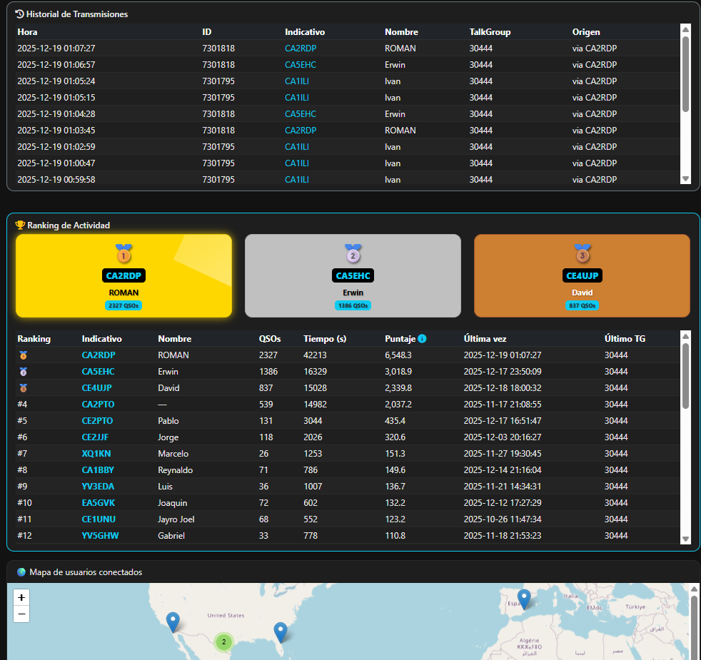

# 📡 LYNK25 – Dashboard Web para Reflector P25

## 🧠 Descripción
**LYNK25** es un dashboard web de monitoreo y personalización para **reflectores P25**. Muestra tráfico en tiempo real, estaciones conectadas, historial de transmisiones, **ranking** con podio, **mapa** por ciudad asociada a la licencia, y **notificaciones por Telegram**. Incluye página **About**, página de **personalización**, y **verificación de versiones**.

Inspirado por el trabajo abierto de **Jonathan Naylor (G4KLX)**, **DVReflector de NØSTAR**, y por la comunidad que hace posibles estos sistemas e inspira dashboards más intuitivos; adicionalmente como es de costubre, nombre, tipologia y colores, se basa en mi entorno familia, esta vez en **mi esposa Jocelyn**, gracias por siempre apoyar mis proyectos

## DASHBOARD

# Presentacion de LYNK25

[VIDEO DE YOUTUBE LYNK25](https://youtu.be/e8MJvyAJ3IA?si=HC4iWXA9b92oYRY0)

## 🚀 Funcionalidades
- **Tiempo real:** tráfico y estado del reflector
- **Estaciones conectadas:** lista dinámica, resalta la última 🆕.
- **Cambio de IP y configuraciones archivo .INI
- **Botones de gestion de servicios y reinicio de servidor.
- **Historial:** transmisiones recientes con filtros.
- **Ranking y podio:** actividad radial automática (Top 3).
- **Mapa:** usuarios geolocalizados por ciudad/licencia (RadioID).
- **Telegram:** alertas a operadores/admins; registro de envíos.
- **Personalización:** edición de título/logo/encabezado sin tocar código.
- **About:** créditos, enlaces, versión.
- **Actualizaciones:** chequeo de versión con 

## 🌍 Integraciones
- **DVReflector API:** para validadcion de reflector online
- **RadioID API:** para nombre/ciudad por ID.
- **Telegram:** para envio de notificaciones, para el admin o para el grupo

## 👉 [Ver instalacion](install.md) 

## 👉 [Ver cambios del sistema](CHANGELOG.md) 
- Chequea constantemente los cambios para que puedas tener tu LYNK25 optimizado y al dia

## Actualizacion
- Solo deber chequear los cambios del sistema y verificar si la version que tienes es la actual, el procedimiento es borrar la capeta html y cargar nuevamente tal cual lo hiciste la primera vez ❣️

## 🤝 Créditos
- **Jonathan Naylor (G4KLX)** – base de software para reflectores/MMDVM.  
- **DVReflector de NØSTAR** – pilar para gestión moderna P25.  
- Comunidad internacional de radioaficionados digitales.  

## 🧑‍💻 Autor

CA2RDP - TelecoViajero
Radioaficionado, desarrollador autodidacta y creador de contenidos digitales:

* 🌐 GitHub: https://github.com/telecov
* 🌐 QRZ: https://www.qrz.com/db/CA2RDP
* 🔗 TikTok: https://tiktok.com/@telecoviajero
* 🔗 Instagram: https://instagram.com/telecoviajero
* 📺 YouTube: https://www.youtube.com/@Telecoviajero

## Te invito a suscribirte a miembros de youtube, tu aporte sin duda apoya a seguir creando contenido
https://www.youtube.com/channel/UCekZOnVxrOoDuJlFCgGKi9A/join
